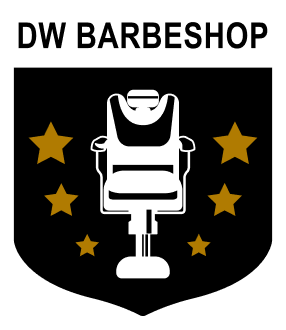
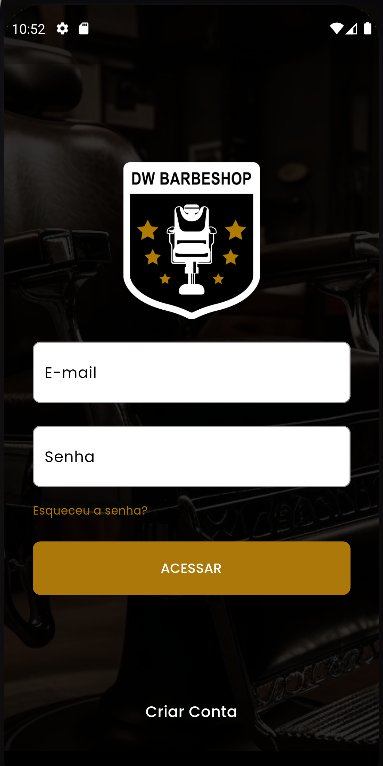
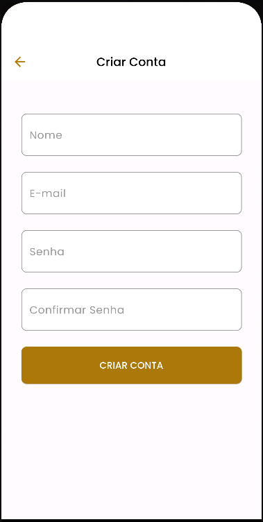
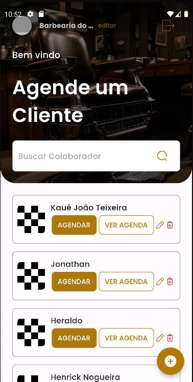
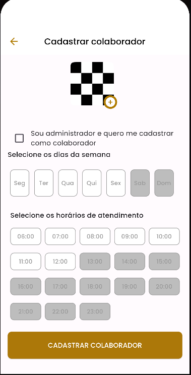
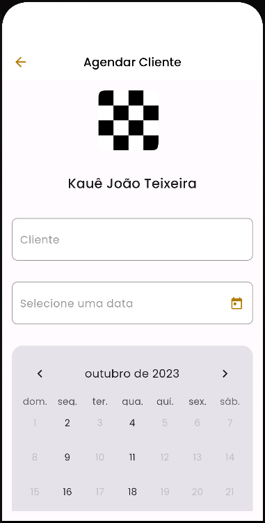
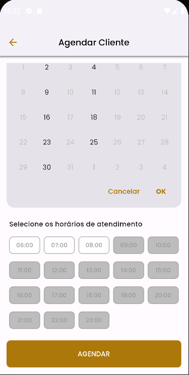
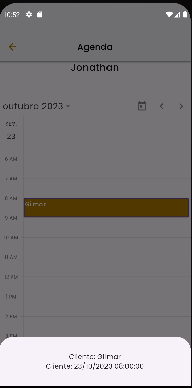
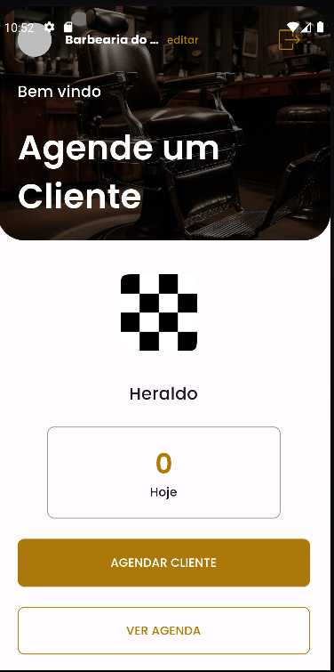

<h1 align="center">
   
</h1>

<h4 align="center"> 
	🚧 DW BARBERSHOP 🚀 Concluido...  🚧
</h4>

## ✅ Funções

- <h3>GERENCIAMENTO DE COLABORADORES</h3>

  - [x] Listagem de Colaboradores
  - [x] Cadastro de Colaborador

- <h3>GERENCIAMENTO DE AGENDAMENTOS</h3>

  - [x] Cadastro de Agendamentos
  - [x] Listagem de Agendamentos

- <h3>Login</h3>

  - [x] Login
  - [x] Cadastro

## 📚 Descrição

- Aplicativo para gestão de uma barbearia criado na imersão DartWeek.

## 🛠 Tecnologias

As seguintes ferramentas foram usadas na construção do projeto:

-  [Flutter](https://flutter.dev/?gclid=Cj0KCQjwkbuKBhDRARIsAALysV4sMSKWcOxrlBmdtlCcf3MAfNdH1ehbbWi6ZjjjdypPLsSvdTFiqOYaAon3EALw_wcB&gclsrc=aw.ds)
-  [Dart](https://dart.dev/)

## 📱 Plataforma adotada

- Android;
- iOS;

## 📸 Screenshot

	
	
	

	
	
	

	
	

